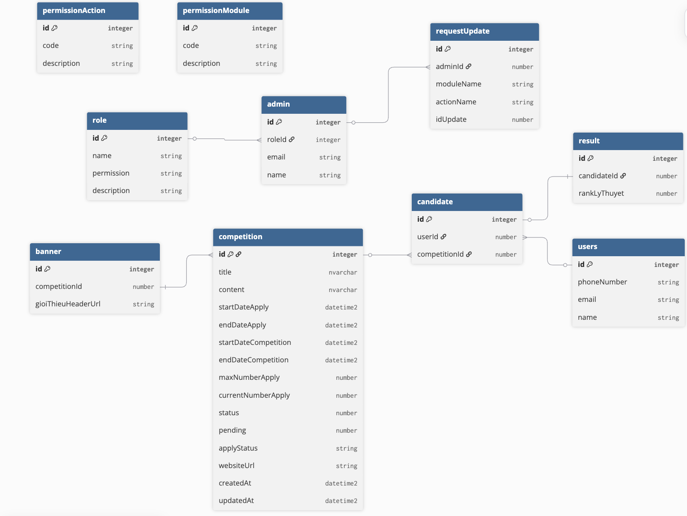

# 🏆 Contest System (Backend - NestJS)

## 📌 Overview

This project is a mini backend system inspired by a real-world contest management platform.

The main focus is not on CRUD operations, but on:

* Fine-grained permission control (RBAC)
* A state-based approval workflow
* Real-time communication via WebSocket
* Clear separation between business logic and access control

---

## 🚀 Tech Stack

* **Framework**: NestJS
* **Language**: TypeScript
* **Auth**: JWT (NestJS Passport)
* **Database**: Microsoft SQL Server
* **ORM**: TypeORM
* **API Docs**: Swagger
* **File Upload**: Local storage

---

## 🗄️ Database Diagram

<p align="center">
  
</p>

> Simplified database diagram focusing on relationships and approval flow.
> Key concepts:
> - RBAC (module + action)
> - Approval workflow via requestUpdate
> - Candidate as a business entity

## 🔐 Permission System (RBAC)

Permissions are designed based on:

* **Module** (e.g. competition, banner)
* **Action** (insert, update, delete, getList, getDetails, review)

Each role contains a set of permissions, and each admin inherits permissions from their role.
> Note: In this mini project, permissions are simplified as a serialized structure. 
> In a production system, this would typically be normalized using a role-permission mapping table.

Example:

* `competition.update`
* `competition.review`

This design allows flexible and scalable access control without hardcoding logic per role.

---

## 🔄 Approval Workflow (Core Design)

### 🧠 Key Idea

Instead of applying changes directly to the main table, this system uses a **state-based approval mechanism**.

* Data is stored directly in the main table (`competition`, `banner`, etc.)
* `requestUpdate` acts as a **control layer**, not a data snapshot

---

### ⚙️ How It Works (Competition Example)

1. Admin updates a competition

2. A new competition record is created (e.g. `id = 2`) with updated data

3. A `requestUpdate` record is created:

   * `moduleName = competition`
   * `actionName = update`
   * `idUpdate = 2`

4. Reviewer (with `competition.review`) approves the request

5. System applies the approved data by updating the original record (`id = 1`)
   based on the pending version (`id = 2`)

---

### 📌 Important Notes

* Original data is preserved temporarily until approval
* After approval, old data is overwritten
* No full history versioning is maintained

---

## ⚖️ Design Trade-offs

### ✅ Advantages

* No duplication of business data in the request layer
* Simple and reusable for multiple modules
* Easy to query main data (no need to join staging table)

### ⚠️ Limitations

* No full audit trail (no snapshot versioning)
* Hard to rollback after approval
* Requires strict control of approval process
* Requires careful state management to ensure data consistency

---

## 🧩 Request Update

The `requestUpdate` table acts as a lightweight approval tracker.

Fields:

* `moduleName`
* `actionName`
* `idUpdate`
* `adminId`
* `status` (wait, approve, reject, return)

It does **not store full data**, only references the target record.

---

## 🏁 Competition State Management

Competition uses multiple fields to represent different aspects of state:

* `status`: lifecycle of competition
  (e.g. created, enrolling, running, finished)

* `pending`: temporary pause flag

* `applyStatus`: approval state

  * `pendingInsert`
  * `pendingUpdate`
  * `pendingDelete`
  * `applied`
  * `reject`
  * `return`
  * `expired`

Only competitions with `applyStatus = applied` are visible to end users.

---

## 👤 Candidate & User Flow

* A user can join multiple competitions
* `candidate` acts as a bridge between `user` and `competition`
* It is not just a join table, but a business entity representing participation

Flow:

1. User selects a competition
2. System checks if user exists
3. If not → create user
4. Create candidate record

---

## 🏆 Result

* Each candidate has exactly one result
* One-to-one relationship is enforced at database level

---

## ⚡ Quick Demo Flow

1. Login as admin → get JWT
2. Admin (no review permission):

   * Update competition → creates request
3. Admin (with review permission):

   * Approve request → data applied
4. User:

   * Only sees competitions with `applyStatus = applied`

---

## 🧠 Real-time Features

WebSocket is implemented to handle real-time communication:

- Track active users via connection/disconnection events
- Broadcast updates to connected clients
- JWT-based authentication during connection handshake
- Works in a single-instance environment (in-memory tracking)

### 🧪 WebSocket Testing

A simple script is provided to simulate real-time connections using `socket.io-client`.

#### Run

```bash
npm run ws:test
```

#### Description

* Logs in via API to obtain a valid JWT
* Establishes WebSocket connections
* Tracks events such as `onlineUsers`

This script is isolated from the main application to keep dependencies clean and simulate real client behavior.


## 🧪 Seed Data

The project includes:

* 2 admin accounts:

  * 1 with review permission
  * 1 without review permission
* Sample data generated using faker

---

## 📬 API Documentation

Swagger is available at:

```
http://localhost:3000/swagger
```

---

## 🛠️ Setup

### 1. Environment

Create a `.env` file in the root directory:

```env
ACCESS_TOKEN_SECRET =...
REFRESH_TOKEN_SECRET =...
ACCESS_TOKEN_EXPIRE =...
REFRESH_TOKEN_EXPIRE =...
DATABASE_USERNAME =...
DATABASE_PASSWORD =...
DATABASE_NAME =...
DATABASE_HOST = 'localhost'
DATABASE_PORT = 1433
SERVER_HOST =...
URL_WEBSITE =...
```

### 2. Run Database

You can use Azure SQL or run a local SQL Server with Docker:

version: '3.8'

services:
  sqlserver:
    image: mcr.microsoft.com/azure-sql-edge
    container_name: azuresqledge
    ports:
      - "1433:1433"
    environment:
      - ACCEPT_EULA=1
      - MSSQL_SA_PASSWORD=YourStrong!Passw0rd

Run:

docker-compose up -d

### 3. Run Application

```bash
npm install
npm run start:dev
```

### 4. Seed Data (Optional)

After creating the database

```bash
npm run seed
```

> Note: The seed script uses `dotenv` to load environment variables.


---

## 💡 Future Improvements

* Add transaction handling for approval process
* Implement optimistic locking for concurrent updates
* Introduce audit logging / versioning
* Normalize permission storage (role-permission mapping table)

---

## 👤 Author

* Duong Anh Dung
